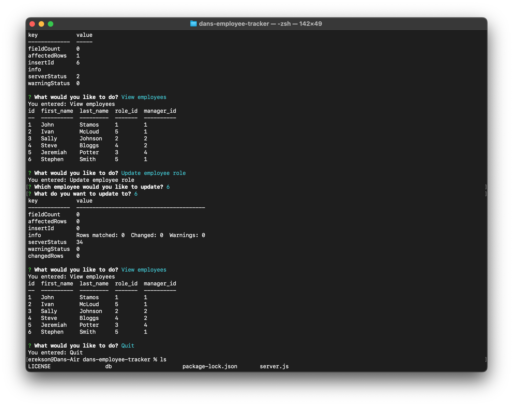

# dans-employee-tracker

A node.js based employee tracker for MySQL

---
### Project Description: 

This is command line employee tracker than uses MySQL2 and node.js with inquirer for input. It also uses dotenv to protect environmental values.

---

### User Story:

```md
AS A business owner
I WANT to be able to view and manage the departments, roles, and employees in my company
SO THAT I can organize and plan my business
```

---

### Deployed Image: 



---
 
* Github URL: 
https://github.com/derekson333/dans-employee-tracker

* Demonstration video: 
https://drive.google.com/file/d/17OEs91adul0vU_2d24ccvdxBlFf_QvYp/view?usp=sharing

---